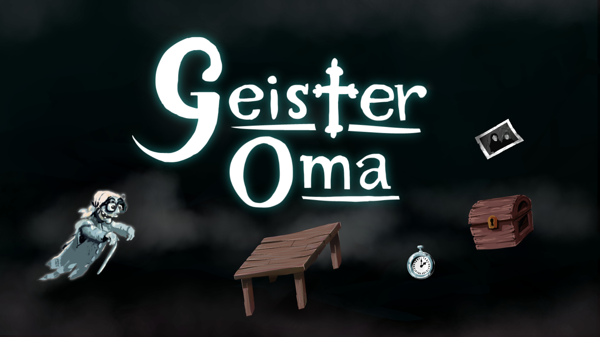

# Game Jam Entry: "Geister Oma"

Recover your memories before it's too late. Didn't manage to add audio in jam time, but we recommend to play this song in the background: [Neil Young - Old Man](https://www.youtube.com/watch?v=SYUgGs9IStY).

This entry was done by @Adams_Lair, @RiderMatt and Mikko Lepistö.

## Running it

Built for a screen resolution of 1920x1080. Lower or higher resolutions might not work that well, depending on how big the difference is. Multi-resolution support wasn't a priority, sorry :)

### The Dev Way

- Clone or download the repository.
- Run `DualityEditor.exe`, let it grab some binaries it needs.
- Close it and run `DualityLauncher.exe`

### The Shortcut

- Download the [binary package](https://github.com/ilexp/bmj2016-11/raw/master/Geister%20Oma.zip)
- Extract and run `DualityLauncher.exe`

## Screenshots

